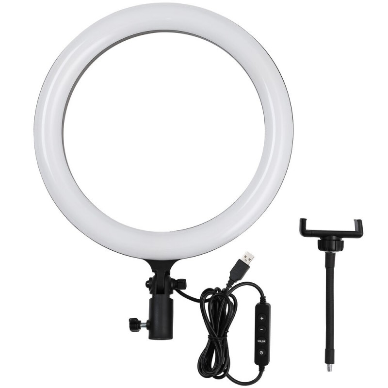
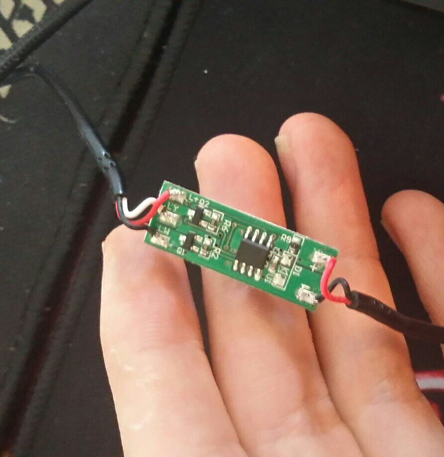

# Led ring uchun ikkinchi hayotni bag'shlash

Yaqinda veb kamera yorug’ligini ta’minlash uchun do’kondan Led RING sotib olishga to’g’ri keldi. Boshida muammosiz ishladi. Bir kun o’tgach esa Gobliddin aka aytgandek Xitoyni moli parot qilishni boshladi. Aniqroq aytadigan bo’lsam platadagi controller ishdan chiqqan edi.

Boshida shunchaki controllerni amashtirib tuzatish fikri tug’ildi. Lekin platani ochib ko’rganimda doimgidek mikrosxema haqida hech qanday ma’lumotlar mavjud emas.

Asosiysi svetodiodlar butunligi. Platadagi controller ishdan chiqishi esa boshqa bir foydali tomonga yordam berdi. Led ring uchun ikkita svetodiod ishlatilgan, biri sarg’ish, yana bir oq fon uchun. Controller vazifasi svetodiodni o’chirib yoqish, ikkita svetodiod rejimini almashtirish va yorqinlikni nazorat qilish edi.

Controllerdan keyingi o’rinlarda svetodiod uchun ikkita mosfet (led dimmer) qo’yilgan ekan. Demak yangi g’oya uchun yarim tayyor plata, qo’shimcha knopkalar ham yo’q emas.

## G’oya o’zi qanday?

Platadagi controller ishlamagach uni qayta yasashga to’g’ri keladi. Albatta birgina potensiometr bilan ishni hal qilish mumkin aslida lekin bu yana mexanik harakatlarni yuzaga keltiradi. Kompyuter qarshisidan turib yorug’likni sozlash kimga ham yoqardi deysiz. Demak biz qayta qiladigan ishlar:

- O’chirib yoqishni ta’minlash
- Rejimlarni almashtira olish
- Yorqinlikni boshqarish
- Yoquridagi bandlarni kompyuter orqali ham bajara olishni ta’minlash

## Yechim:

Velosipedni qayta ixtiro qilib o’tirish shart emas. Shu sababli ham tayyor arduino (atmega 328)dan foydalanish mumkin va bu ishni ancha osonlashtiradi ham. Kompyuter bilan ulash uchun plata o’zida tayor ch40 serial controller ham bor qaytaga.

## Sxematika:

Led ring platasini modlash oson masala. A09T dimmer gate uchun arduinodagi interruptlardan foydalanamiz. Bu bizga yorqinlikni boshqarish uchun yuqori signal generatsiya qilishni ta’minlab bera oladi. Qolgan buttonlarni esa istalgan pinlar orqali INPUT_PULLUP yordamida holatini boshqaramiz.

INPUT_PULLUP arduinoda tashqi resistor yordamisiz ichki resiztordan source olish imkonini beradi. Bu bilan biz button va groundlar o’rtasida kalit yasash orqaligina yengil chiqa olamiz.

## Tuzuvchi

Loyiha dasturchisi: [Yetimdasturchi](https://manu.uno)

## Yordam

- [Telegram](https://t.me/Arduino_Uzbekistan)
- [YetimDasturchi](https://t.me/yetimdasturchi_chat)

## License

[MIT](LICENSE)